# Code-Mixed Sentiment Analysis with Flask based GUI

The aim of the project is to use Sentiment Analysis to analyse the text data and interpret the sentiment of the information. Such models have many uses, one of which is for companies to analyse public opinion on upcoming launches. Such comments can be scraped from social media platforms by searching keywords and run through a sentiment analysis model to gather general impression among the population. Existing work shows that various approaches are used for sentiment analysis like machine learning, corpus based, NLP based or even based on clustering.

## INTRODUCTION

### CODE MIXING
Code-mixing is the phenomenon of mixing the vocabulary and syntax of multiple languages in the same sentence. It is an increasingly common occurrence in today’s multilingual society and poses a big challenge when encountered in different downstream tasks [1]. It’s prevalence on social media leads to the production of a huge amount of code-mixed data which can be analysed and interpreted to mine information. This data can be extracted from platforms such as Facebook, Twitter, online blogs, Amazon reviews, etc.

### SENTIMENT ANALYSIS
With the recent advances in deep learning, the ability of algorithms to analyse text has improved considerably. [2] Present-day Sentiment Analysis’ models can be used fairly effectively to classify textual data in a given language. However, these models can provide unsatisfactory results when the given data is an amalgamation of more than one language. Consequently, there is a growing need for studying code-mixed hybrid languages. The project aims to find a better solution to the this problem and provide applications where the model can be applied successfully.

## APPROACH

### DATASET
1.	Our task is to classify text data in code-mixed Hinglish language [15]. Although code-mixing has received some attention recently, properly annotated data is still scarce. To overcome this hurdle we make use of the Hinglish dataset from [16] to perform sentiment analysis of code-mixed tweets crawled from social media. Each tweet is classified into one of the three polarity classes - Positive, Negative, Neutral. Each tweet also has word-level language marking. However, for our current application, we only make use of the three categories of sentiment, rather than the word-level marking. 
2.	The Hind-English mixed dataset proposed by [3] consists of user comments collected from public Facebook pages popular in India. The pre-processed data was limited to 50 words and manually annotated in a 3-level polarity scale - positive, negative or neutral.
3.	In addition, we made use of Tweepy, the Twitter API to scrape data using Hindi keywords and each one of us three manually annotated the data separately, and only included tweets in which we agreed on the label. This is vital due to difference in perception of sentiments by individuals, different interpretations by them and sarcastic nature of some comments which is common in social media data. 

Our final dataset includes 23K entries, each with a label of either 0,1,2 (0-negative, 1-positive, 2-neutral). The dataset is further divided into Training Set (16K entries), Validation Set (3K entries) and Testing Set (4K entries).

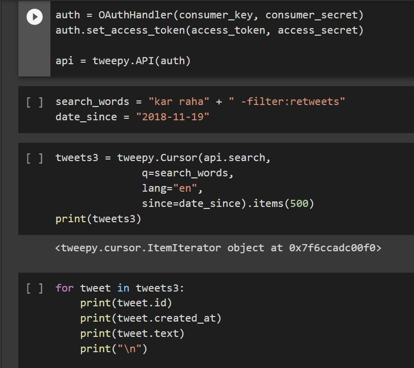

Fig. Extracting tweets to expand dataset using tweepy library

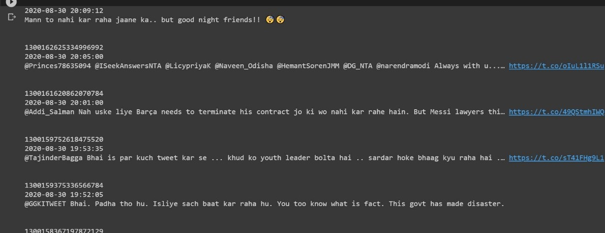

Fig. Data entries as collected from twitter.

### PRE-PROCESSING
As social media text is different from the regular text with irregular grammar, elongation, and all the informal usages of language, we needed to improve the quality of the text as it has a major effect on the final score. 
So we perform our pre-processing steps as follows: 
*	Remove emoticons and emojis.
*	Remove URLs. “This is so funny www.example.com” → “This is so funny" 
*	Extract words from hashtags. “#BeautifulDay” → “Beautiful Day”
*	Convert all text to lowercase. “Kaisa hai bhaI” → “kaisa hai bhai”
*	Remove ‘@’ twitter mentions. “@Salman bhai” → “Salman bhai”
*	Remove non-character symbols like %, $, *, etc.

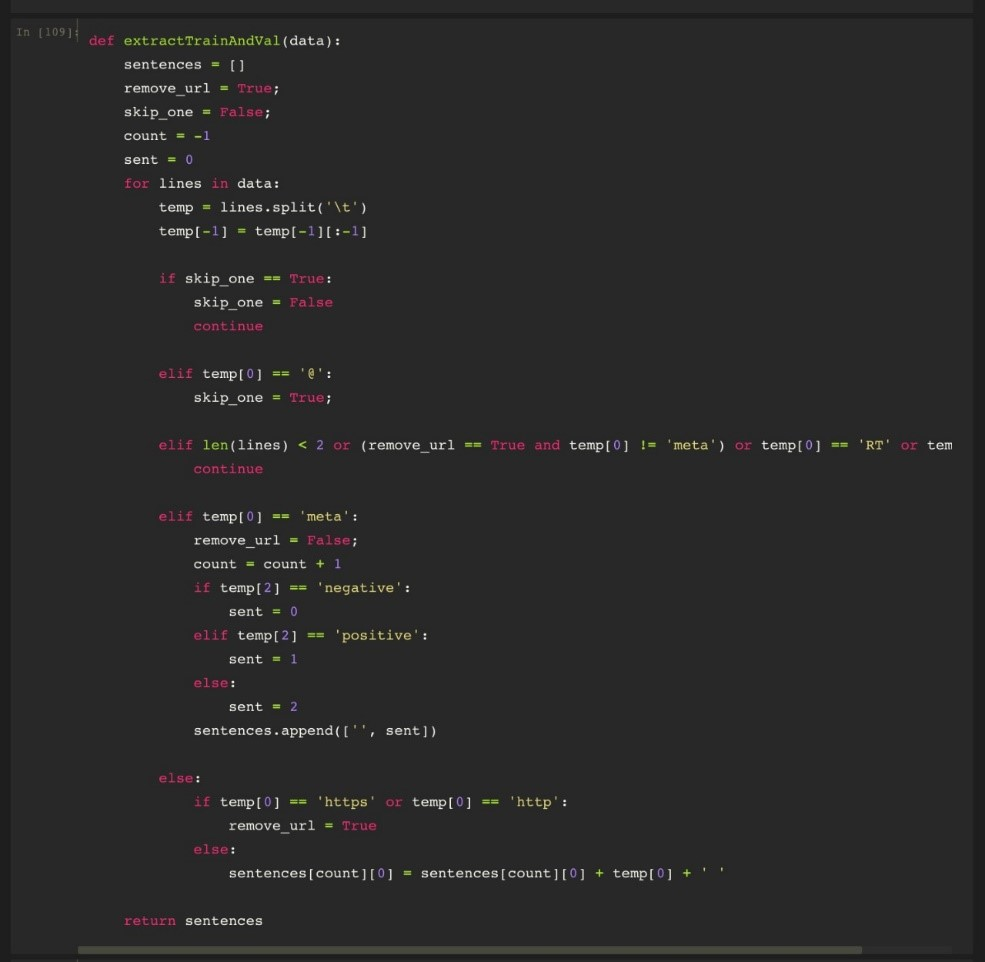

Fig. Function to label the data extracted from different sources

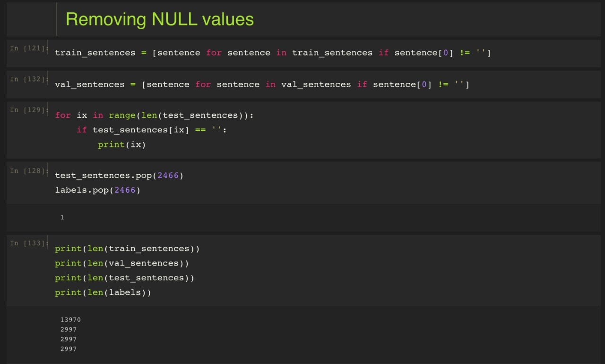

Fig. Removing NULL values

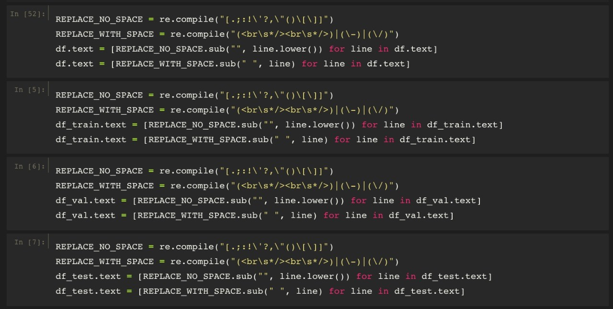

Fig. Pre-process data

### MODEL
Our best performing system is a fine-tuned XLM-RoBERTa , which is a general purpose sentence representation and an extended version of mBERT and XLM [18] and is based on Transformers. Introduction of XLM-R model has led to an explosion of research in this area, with researchers trying various approached to build upon XLM-R model, trying to increase accuracy of the model by focusing on the factors raised in the XLM-R model research paper. For this code-mixing sentiment classification task, the input sentence will be organized as 

[CLS],w1,w2,...,wn,[SEP] 

where the [CLS] token is inserted in the beginning place of the sequence which is used as an indicator of the whole sentence, and specifically it is used to perform sentiment classification. The [SEP] is a token to separate a sequence from the subsequent one and is an indicator of the end of a sentence. wi is token of the sequence. After they go through the model, for each item of the sequence, a vector representation of the size H, size of specified hidden layers, is computed. The representation of [CLS] is applied with a fully connected layer to classify the three sentiment labels including negative, neutral, and positive. 

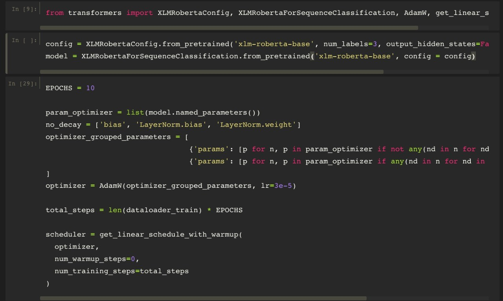

Fig. Importing and using XLM-Roberta transformer

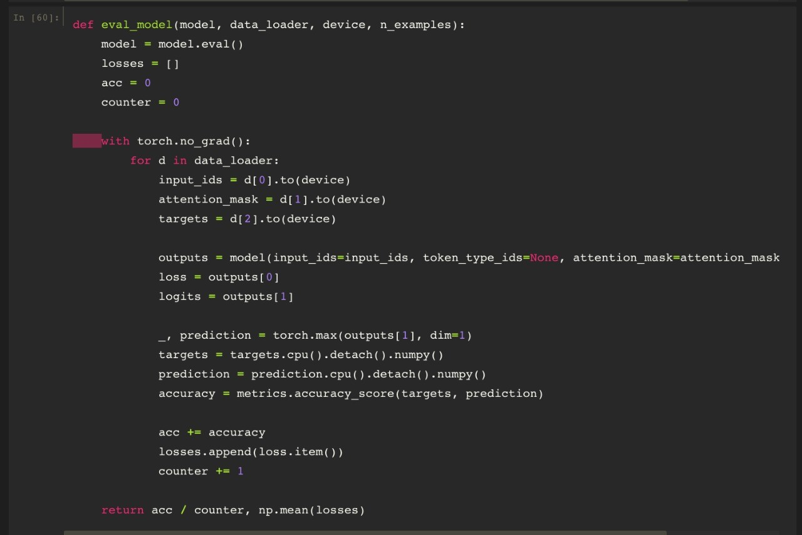

Fig. Model Evaluation

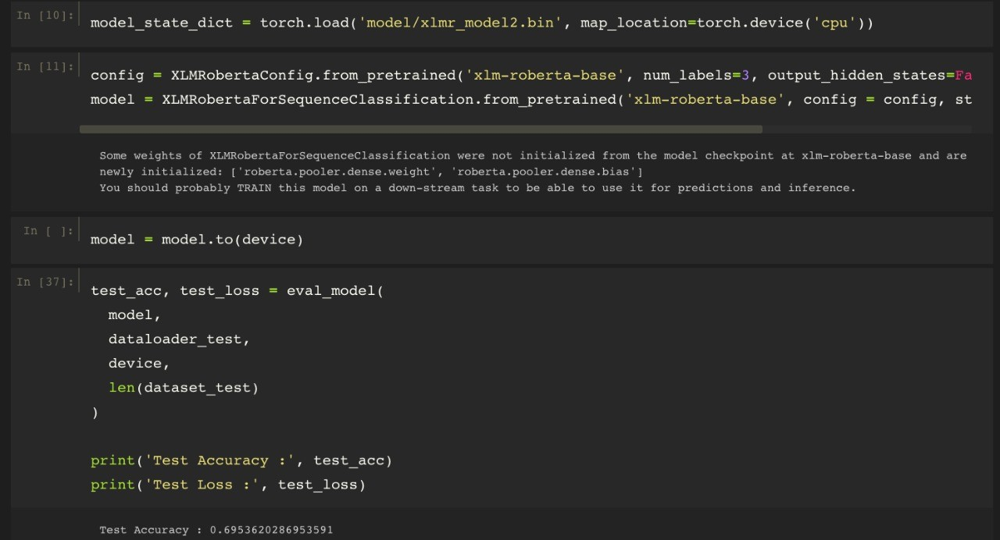

Fig. Loading and using XLM-Roberta transformer

In recent years, a lot of models based on Transformer have been proposed such as BERT [6], RoBERTa [5] and ALBERT. Those models take advantage of both available large corpora and computational power and have outperformed the traditional techniques in various sentiment analysis tasks. Using HuggingFace Transformers library we fine-tuned XLM-RoBERTa base model on our training data in a randomly shuffled fashion.

### REAL-TIME TWEETS EXTRACTION
Similar to how we collect twitter data to train our model, we use the Tweepy library to collect tweets about our product in real-time. These tweets are then pre-processed, passed through our trained model to extract sentiment and stored in our database. At present, we collect tweets related to OnePlus, Airtel and BJP. This allows us to visualize the different distribution of positive, negative and neutral tweets.

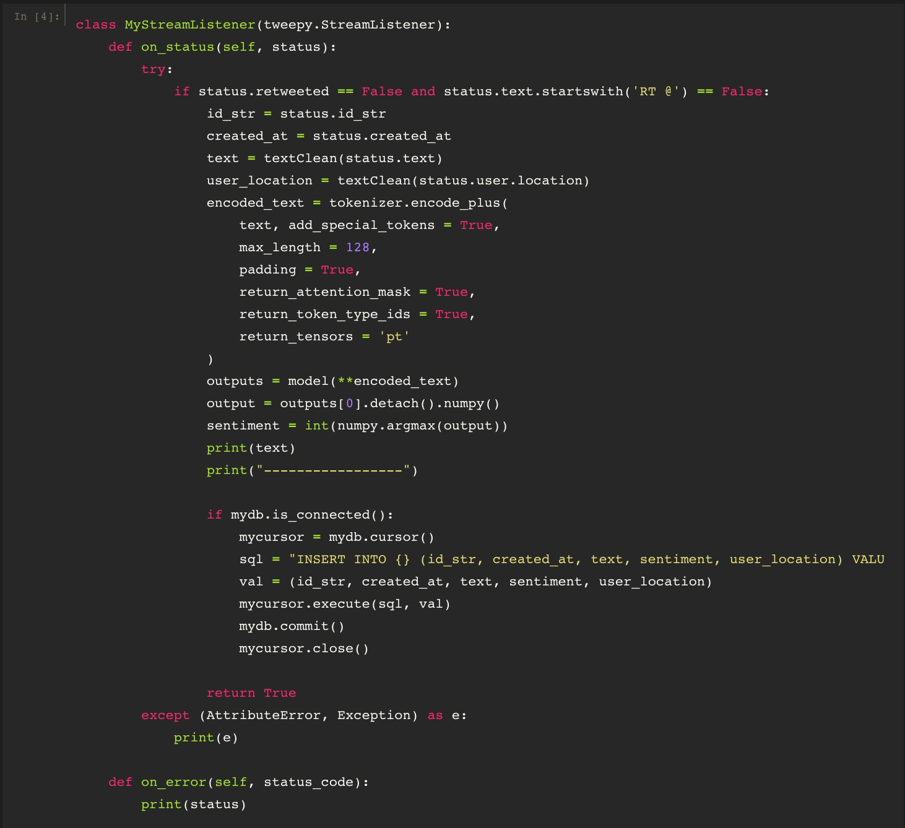

Fig. Extracting tweets related to BJP

### USER INTERFACE AND DATA VISUALISATION
We created a web portal for authorized users to access the data we collected and display it through interactive graphs and plots.

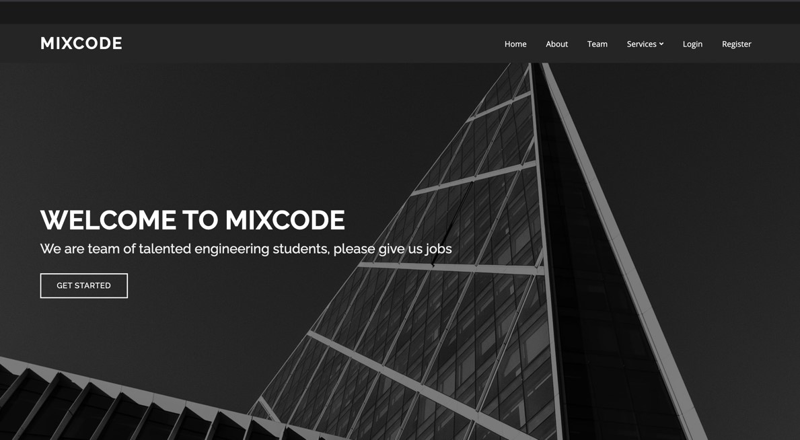

Fig. Home Page of Web Portal.

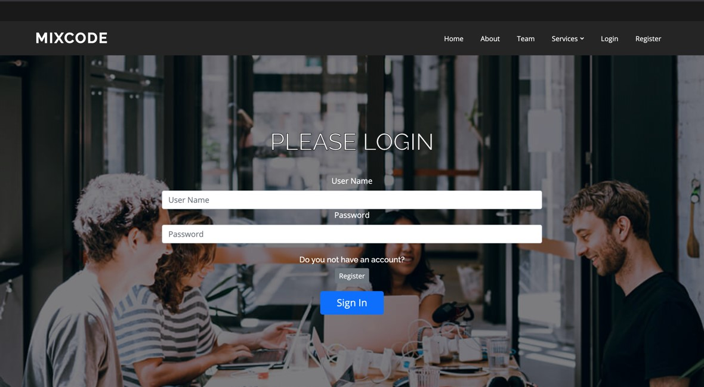

Fig.Login Page to authorize users

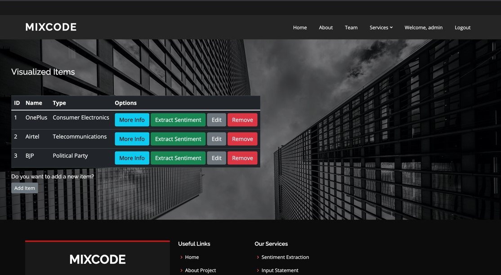

Fig.Feature which allows user to try out our model

Fig. Dashboard displaying different products we can analyse

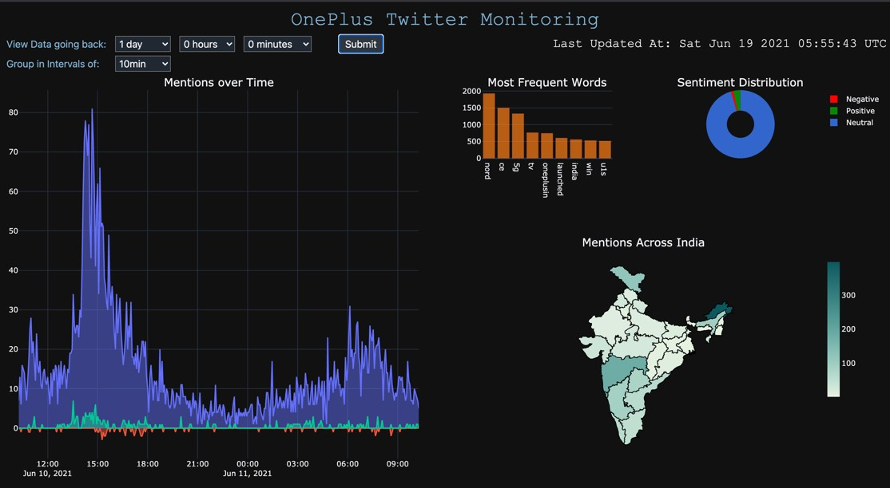

Fig. OnePlus Twitter Monitoring Dashboard

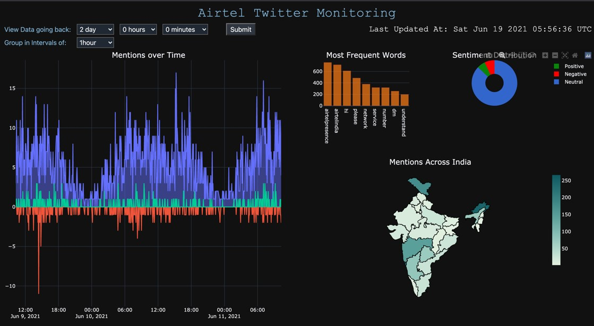

Fig. Airtel Twitter Monitoring Dashboard

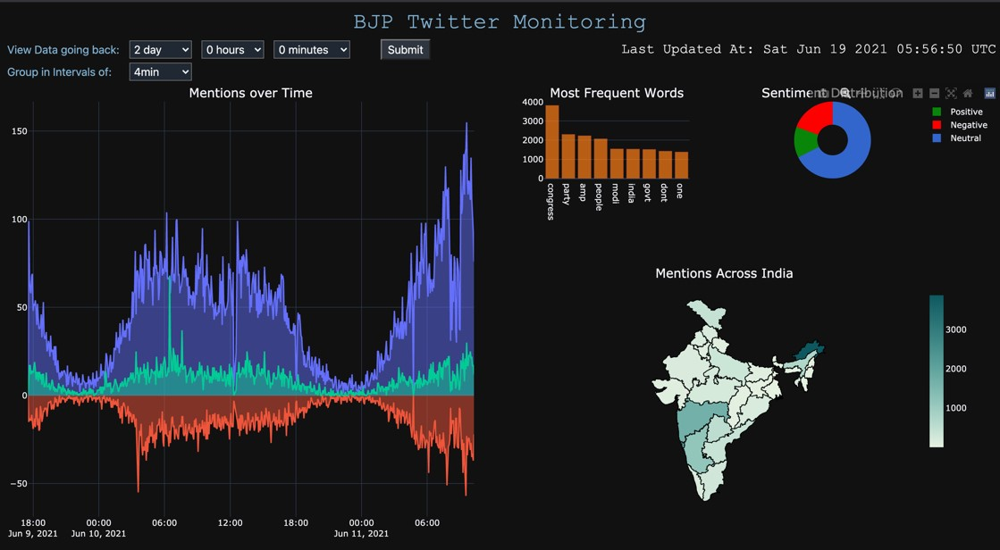
 
Fig. BJP Twitter Monitoring Dashboard

## CONCLUSION

The age of getting meaningful insights from social media data has now arrived with the advance in technology. The project in discussion gives you a glimpse of the power of the technology of sentiment analysis. It’s time for your organization to move beyond overall sentiment and count based metrics. Companies, organisations and governments have been leveraging the power of data lately, but to get the deepest of the information, you have to leverage the power of AI, Deep learning and intelligent classifiers like Sentiment Analysis. Hundreds of fields can now make use of this tool, for example, policy making, analysing reviews of students, reaction to government laws, market research before a product launch etc. Since this technology is now not limited to a single language, inclusion of social media data can be of immense use to these fields; and hence benefit the society. 

From our observations, we find that using bi-grams and tri-grams do not help improve the accuracy. In addition, the implementation of transformer-based tokenizers is promising as they are trained on an enormous amount of data and will be utilised as we keep trying to improve the accuracy of the model. Making the visualization of this data available to the appropriate people in real-time also helps make better marketing decisions to them. Hence this project proved to be a step in the right direction and further upgradations will try to follow suit.

## BIBLIOGRAPHY

[1] 	Y. K. Lal, V. Kumar, M. Dhar, M. Shrivastava and P. Koehn, "De-Mixing Sentiment from Code-Mixed Text," ACL Anthology, p. 7, August 2019. 
[2] 	S. Gupta, "Sentiment Analysis: Concept, Analysis and Applications," 7 January 2018. [Online]. Available: https://towardsdatascience.com/sentiment-analysis-concept-analysis-and-applications-6c94d6f58c17.
[3] 	A. Prabhu, A. Joshi, M. Shrivastava and V. Varma, "Towards Sub-Word Level Compositions for Sentiment Analysis of Hindi-English Code Mixed Text," arXiv, 2016. 
[4] 	N. Choudhary, R. Singh, I. Bindlish and M. Shrivastava, "Sentiment Analysis of Code-Mixed Languages leveraging Resource Rich Languages". 
[5] 	Y. Liu, M. Ott, N. Goyal, J. Du, M. Joshi , D. Chen, O. Levy, M. Lewis, L. Zettlemoyer and V. Stoyanov, "RoBERTa: A Robustly Optimized BERT Pretraining Approach," arXiv, 2019. 
[6] 	J. Devlin, M.-W. Chang, . K. Lee and K. To, "BERT: Pre-training of Deep Bidirectional Transformers for Language Understanding," in NAACL-HLT, Minneapolis, 2019. 
[7] 	A. Tumasjan, T. O. Sprenger and P. G. Sa, "Predicting Elections with Twitter: What 140 Characters Reveal about Political Sentiment," in Fourth International AAAI Conference on Weblogs and Social Media, 2010. 
[8] 	B. J. Jansen, M. Zhang , K. Sobel and A. Chowdury, "Twitter power: Tweets as electronic word of mouth," 2009. 
[9] 	P. Singh and E. Lefever, "Sentiment Analysis for Hinglish Code-mixed Tweets by means of Cross-lingual Word Embeddings," in Language Resources and Evaluation Conference (LREC 2020), Marseille, 2020. 
[10] 	Y. Vyas, S. Gella, J. Sharma, . K. Bali and M. Choudhury, "POS Tagging of English-Hindi Code-Mixed Social Media Content," in Conference on Empirical Methods in Natural Language Processing , Doha, 2014. 
[11] 	A. Sharma, S. Gupta, R. Motlani , P. Bansal, M. Shrivastava , R. Mamidi and D. M. Sharma, "Shallow Parsing Pipeline for Hindi-English Code-Mixed Social Media Text," in NAACL-HLT , San Diego, 2016. 
[12] 	S. Rijhwani, R. Sequiera, M. Choudhury , K. Bali and C. S. Maddi, "Estimating Code-Switching on Twitter with a Novel Generalized Word-Level Language Detection Technique," in 55th Annual Meeting of the Association for Computational Linguistics, Vancouver, 2017. 
[13] 	A. Pratapa, . G. Bhat, M. Choudhury, S. Sitaram, . S. Dandapat and K. Bali, "Language Modeling for Code-Mixing: The Role of Linguistic Theory based Synthetic Data," in 56th Annual Meeting of the Association for Computational Linguistics, Melbourne, 2018. 
[14] 	A. Konate and R. Du, "Sentiment Analysis of Code-Mixed Bambara-French Social Media Text Using Deep Learning Techniques," Wuhan University Journal of Natural Sciences, 2018. 
[15] 	C. Barnali, "Code-Switching and Mixing in Communication −A Study on Language Contact in Indian Media," RESEARCH ASSOCIATION for INTERDISCIPLINARY OCTOBER , 2017. 
[16] 	P. Patwa, G. Aguilar, S. Kar, S. Pandey, S. PYKL, B. ̈. Gamba ̈ck, T. Chakraborty, T. Solorio and A. Das, "SemEval-2020 Task 9: Overview of Sentiment Analysis of Code-Mixed Tweets," arXiv, 2020. 
[17] 	A. Conneau, K. Khandelwal, N. Goyal , V. Chaudhary , G. Wenzek , F. Guzman, E. Grave , M. Ott , L. Zettlemoyer and V. Stoyanov, "Unsupervised Cross-lingual Representation Learning at Scale," Facebook AI, 2020. 
[18] 	G. Lample and A. Conneau, "Cross-lingual Language Model Pretraining," 2019. 
[19] 	H. Baruah, "Machine Transliteration in Code-Mixed Indian Social Media Text," 2019. [Online]. Available: https://www.iitg.ac.in/cseweb/osint/slides/Hemanta.pdf.
[20] 	S. Govilkar and M. A. Ansari, "SENTIMENT ANALYSIS OF MIXED CODE FOR THE TRANSLITERATED HINDI AND MARATHI TEXTS," International Journal on Natural Language Computing, p. 14, April 2018. 
